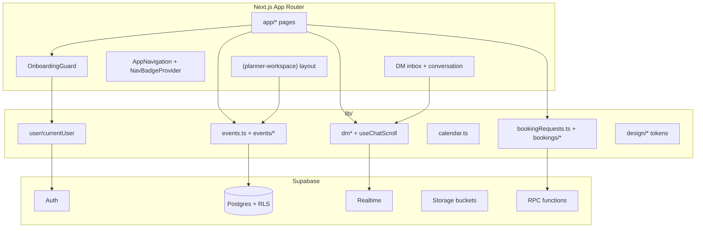

# Claude Implementation Handover — Follow The Crowd (FTC)

**Purpose:** Temporary replacement for Cursor as implementation engineer until Isaac’s Cursor usage resets.  
**Audience:** Claude (Builder).  
**Created:** 2026-07-30  
**Based on:** Live repository inspection + `docs/handoff/*`, `FTC_WORKFLOW.md`, `docs/qa/*`, `docs/design/FTC_DESIGN_SYSTEM.md`.  
**Do not treat this as permission to invent architecture.** Prefer reading the cited files over guessing.

---

## How to start a session

1. Repo path: `/Users/isaaccunningham/Projects/FTC`
2. GitHub: `itcunningham/follow-the-crowd`
3. Read in order:
   - `FTC_WORKFLOW.md`
   - `docs/handoff/HOW-WE-WORK.md`
   - `docs/handoff/USER-PREFERENCES.md`
   - `docs/handoff/HANDOFF-UPDATE.md`
   - `docs/handoff/PROJECT.md`
   - `docs/handoff/CURRENT-STATE.md` (dense; authoritative product state)
   - `docs/handoff/SUPABASE.md` (verify claims against migrations / live behaviour)
   - this file
4. For UI work: `docs/design/FTC_DESIGN_SYSTEM.md`
5. Agent rules: `AGENTS.md` (`CLAUDE.md` is only `@AGENTS.md`)

**Roles (Isaac’s process):**

| Who | Job |
|-----|-----|
| **Isaac** | Product owner. Runs SQL in Supabase SQL Editor. Manual QA. Approves direction. |
| **Claude (you, temporarily)** | Builder: implement, build, commit/push only when asked. Update `docs/handoff/` on ship. |
| **ChatGPT** | Planning / specs / QA lists — no repo access. |
| **Reviewer / QA agents** | Read-only unless Isaac authorises. Never commit. |

**One writer rule:** only one Builder task edits the repo at a time. Never change Supabase SQL unless the task explicitly requests SQL.

---

## 1. Repository overview

### Product

Follow The Crowd (FTC) — mobile-first Next.js + Supabase app for **promoters/planners** and **DJs**.

- Planners: events, Event Plans, calendar, booking-request DMs, lineups, run sheets, crew (group) chat.
- DJs: profiles, booking requests, rate proposals, availability, DMs, crew chat, Gigs list/calendar.
- **Private beta 0.9.0** (coached GO dated 2026-07-16). Out of scope: payments, AI generation (disabled), Discover expansion, social launch features.

Legacy name **eventos** still appears in some paths/docs — same product.

### Stack

| Layer | Choice |
|-------|--------|
| Framework | Next.js **16.2.9** App Router (`app/`) |
| UI | React 19, Tailwind 4, custom FTC tokens in `app/globals.css` |
| Backend | Supabase (Postgres, Auth, Storage, Realtime, RPC) |
| Language | TypeScript |
| Deploy | Vercel — push to `main` deploys production |
| Tests | `scripts/test-regressions.mts` (tsx), Playwright WebKit e2e against production |

**Important:** Next.js APIs may differ from Claude training data. Check `node_modules/next/dist/docs/` before assuming APIs. See `AGENTS.md`.

### Top-level tree

```
FTC/
├── app/                      # Next.js App Router pages + UI
├── lib/                      # Data access + business logic (prefer here over page bloat)
├── docs/
│   ├── handoff/              # Session context — update on every ship
│   ├── design/               # FTC_DESIGN_SYSTEM.md
│   └── qa/                   # Beta / regression / known issues
├── scripts/                  # QA reset, regressions, legacy SQL bootstrap
├── supabase/migrations/      # Versioned SQL (Isaac pastes into SQL Editor)
├── e2e/                      # Playwright journeys + helpers
├── FTC_WORKFLOW.md           # Builder / Reviewer / QA agreement
├── AGENTS.md                 # Agent rules
├── middleware.ts             # Host canonicalization ONLY — not auth
└── package.json              # version 0.9.0
```

### Main application architecture



**Auth is not middleware.** `middleware.ts` only redirects preview hosts to the canonical production host. Session/onboarding is enforced per page by `OnboardingGuard`.

### Important folders

| Path | Role |
|------|------|
| `app/(planner-workspace)/` | Shared chrome for Events / Event Plans / Calendar / Gigs |
| `app/dm/` | Messages inbox + conversation |
| `app/events/` | Create + event detail + crew chat (detail is outside workspace group) |
| `app/components/` | Shared UI (~54 top-level entries + domain subfolders) |
| `app/components/skeleton/` | Loading shells matching loaded layouts |
| `lib/dm/` | DM scroll, composer keyboard, grouping, timestamps, reactions inbox, thread nav |
| `lib/events/` | Form validation, caches, covers, list nav, crew unlock |
| `lib/bookings/` | Gigs tabs, caches, deep links, calendar nav |
| `lib/design/` | Design-system class tokens (workspace tokens are a leaf module — TDZ-safe) |
| `lib/navigation/` | Fixed chat mount, mobile keyboard session, scroll helpers |
| `docs/handoff/` | Must update on completed tasks |
| `supabase/migrations/` | Isaac-applied SQL |

### Shared utilities (non-exhaustive — search before inventing)

| Area | Key modules |
|------|-------------|
| Auth / profile | `lib/user/currentUser.ts`, `lib/auth/sessionUserId.ts`, `lib/profileNavigation.ts` |
| Supabase client | `lib/supabaseClient.ts` |
| Events | `lib/events.ts`, `lib/events/eventFormFieldValidation.ts`, `lib/events/eventsListNavigation.ts` |
| Bookings | `lib/bookingRequests.ts`, `lib/bookingDateTime.ts`, `lib/bookingRate.ts` |
| Calendar | `lib/calendar.ts`, planner/DJ calendar caches + prefetch |
| DM | `lib/dmInbox.ts`, `lib/dmAttachments.ts`, `lib/dmReactions.ts`, `lib/dm/*` |
| Group / crew | `lib/groupChats.ts`, `lib/eventCrewChat.ts` |
| Unread | `lib/messageReads.ts`, `lib/inboxUnread.ts`, `lib/navigationBadgeCache.ts` |
| Text limits | `lib/textInputLimits.ts`, `lib/cappedMultilineInput.ts` |
| Feedback | `lib/design/inlineTabFeedback.ts` + `PlannerTitleFeedbackProvider` |
| App version | `lib/ftcAppVersion.ts` |

### Shared hooks / scroll helpers

| Module | Purpose |
|--------|---------|
| `lib/useChatScroll.ts` | Chat pin-to-bottom, append detection, ResizeObserver re-pin (images) |
| `lib/dm/useDmChatScrollRestoreOnProfileReturn.ts` | Profile-return scroll restore via sessionStorage (**see outstanding bug**) |
| `lib/dm/useComposerTextareaAutogrow.ts` | Composer height |
| `lib/dm/useMessageReactionLongPress.ts` / `useMessageReactionDoubleTap.ts` | Reaction gestures |
| `lib/useChatNewMessageHighlight.ts` / `lib/useChatBookingFocusHighlight.ts` | Visual focus rings |
| `lib/dm/dismissComposerKeyboardOnIntentionalScroll.ts` | iOS keyboard dismiss policy |
| `lib/useBoundedAutoGrowTextarea.ts` | Bounded textarea growth |

### Shared components (by domain)

```
app/components/
├── OnboardingGuard.tsx, AppNavigation.tsx, AppProviders.tsx
├── dm/           # Inbox layout, composer, bubbles, reactions, attachments, header
├── chat/         # ComposerMessageField, bubble shell, incoming layouts
├── group-chat/   # Crew chat UI
├── booking/      # Rate proposal, send bookings, status badge, DM card layout
├── bookings/     # Gigs workspace chrome / tabs
├── planner/      # Workspace layout, title feedback, PlannerUi
├── events/       # List tabs, artwork, colour fields
├── event-detail/ # Hero, lineup, layout tokens
├── calendar/     # Mobile chrome / legend
├── skeleton/     # AppLoadingShell + per-route shells
├── profile/, history/, feedback/, navigation/, ftc/, brand/
└── BookingRequestCard.tsx  # Critical shared DM booking card
```

### Design system

- **Human source of truth:** `docs/design/FTC_DESIGN_SYSTEM.md`
- **Code tokens:** `lib/design/ftcDesignSystem.ts`, `lib/design/ftcStatusBadge.ts`, `lib/design/plannerWorkspaceTokens.ts`, `lib/ftcFlatStatus.ts`
- **CSS:** `app/globals.css` (`:root` variables + `.ftc-*` classes)
- Look: dark navy surfaces, subtle borders, solid accents — **no neon, glow, gradients on controls, cyberpunk styling**
- Mobile-first **390px**; desktop parity **~1280px** (`FTC_WORKFLOW.md` §8 — note CURRENT-STATE sometimes cites §7 incorrectly)

### Routing structure

```
/                         splash → role default (/events or /dm)
/login /signup /onboarding /profile/setup

/(planner-workspace)      # URL group — not in path
  /events                 Active / History list + create flow
  /booking-plans          Event Plans
  /calendar               Events + Gigs calendar modes
  /bookings               Gigs Incoming / Confirmed / History

/events/create
/events/[eventId]         Event Details (+ edit)
/events/[eventId]/chat    Crew / group chat

/dm                       Messages inbox (?tab=group)
/dm/[conversationId]      DM thread
/group-chats              Group inbox surface
/profile/[userId]
/settings /notifications
/discover                 RETIRED — redirects by role
/api/generate-event       AI (disabled unless flags)
/api/account/delete
```

Planner sub-nav model: `lib/plannerEventsNav.ts` + `PlannerEventsSubNav`.

---

## 2. Current project status

### Git

| Item | Value |
|------|--------|
| Branch | `main` |
| HEAD (as of handover write) | `3d25e52` — Allow sending up to 10 photos in one DM message |
| Deploy | Push to `main` → Vercel production |

### Latest important commits (recent DM / messaging focus)

| Hash | Summary |
|------|---------|
| `3d25e52` | Multi-photo DM send (up to 10) |
| `7b65b54` / `c9f2450` | Unified DM inbox preview formatter + handoff |
| `99e4fa6` / `6f2633b` | Image layout scroll pinning |
| `330c292` | Photo/file inbox preview for image-only messages |
| `02875a4` / related | Reaction DELETE inbox fix (local state, not payload.old) |
| `a46262e` / `71a4604` | Reaction inbox activity + author notifications |
| Long series Jul 28–30 | Chat density, grouping, reactions, composer, keyboard, booking cards |

`CURRENT-STATE.md` “Recent commits” list is long and partially stale relative to HEAD (e.g. may not list `3d25e52` yet). Prefer `git log` for truth.

### Dirty working tree at handover time (do not casually commit)

| Path | Notes |
|------|--------|
| `lib/dm/dmChatScrollRestoration.ts` | **Partial unfinished fix** for DM scroll-restore bug (adds `restoreScroll` helpers; hook not wired) |
| `docs/qa/FTC-BETA-ENVIRONMENT-RESET.md` | Unrelated QA reset doc edits |
| `scripts/reset-qa-environment.mts` / `scripts/resetQaEnvironment.sql` | Unrelated QA reset script edits |
| `QA_RESET_TO_PASTE.sql` | Untracked |
| `.cursor/permissions.json` | Untracked Cursor config — not app code |

### Beta stage

- **Coached private beta GO** (2026-07-16): 5–10 Planner/DJ pairs.
- App version string: `FTC Private Beta 0.9.0 · Build <short-commit>` (`lib/ftcAppVersion.ts`).
- Docs: `docs/qa/PRIVATE-BETA-GO-LIVE.md`, `BETA-READINESS-CHECKLIST.md`, `TESTER-ONBOARDING.md`, `KNOWN-ISSUES.md`.
- Pause rule: new Critical/High production defect pauses tester onboarding.
- Operational checklist OP-01–OP-11 may still need Isaac confirmation before invites.

### Outstanding work / areas being worked on

1. **DM scroll restoration bug (in progress, unfinished)**  
   Opening a conversation from the Messages inbox can restore an old message-list `scrollTop` from sessionStorage instead of scrolling to the latest message.  
   Root cause: `useDmChatScrollRestoreOnProfileReturn` consumes `ftc-dm-chat-scroll:{id}` on **every** mount with no “returning from profile” gate.  
   Partial helpers exist in `dmChatScrollRestoration.ts` (`DM_CHAT_SCROLL_RESTORE_PARAM`, `buildDmChatScrollRestoreHref`, `shouldRestoreDmChatScroll`) but are **not wired**. Finish or revert — do not leave half-done.

2. **Regression suite TEMP-SKIPs** — ~12 tests commented out in `scripts/test-regressions.mts` `main()` for “pre-existing unrelated failures”. Comments cite CURRENT-STATE, but CURRENT-STATE does **not** document them. Suite green ≠ full coverage.

3. **SQL / ops** — Isaac may still need to confirm migrations applied (see SUPABASE caveats below). QA reset tooling has local uncommitted edits.

### Known issues (documented)

Accepted for beta in `docs/qa/KNOWN-ISSUES.md`:

| ID | Topic | Honesty note |
|----|--------|--------------|
| KN-01 | Event detail Bookings row profile tap | Still listed as accepted |
| KN-02 | Event → Open DM → Back goes to Messages | **Resolved** — Production verified 2026-09-01 (`from=event-detail` return chains) |
| KN-03 | Profile tab latency | Accepted Low |
| KN-04 | Crew chat View event return | Accepted Low |
| KN-05 | Secondary return paths | Accepted Low |
| KN-06 | Event name/venue character caps | **Stale** — code ships 30-char caps via `PLANNER_EVENT_PLAN_SHORT_TEXT_MAX_LENGTH` (CURRENT-STATE 2026-07-22). KNOWN-ISSUES not updated. |

---

## 3. Technical architecture

### Authentication

- Supabase Auth (email; session in browser).
- `OnboardingGuard` gates authenticated surfaces:
  1. Optimistic UI from cached nav role + userId where safe
  2. `getCurrentAuthUser()` / profile
  3. Unauthenticated → `/login`
  4. Missing profile row → ensure row
  5. Incomplete onboarding → `/onboarding`
  6. Missing display_name/username → `/profile/setup`
  7. `/` → DJ → `/dm`, else → `/events` (splash: `FtcAppSplashScreen`)
- Profile + role caches: localStorage, userId-scoped; badge caches warmed at module load.
- **Do not add Next middleware auth** without an explicit product decision — current design is intentional.

### Supabase

- Client: `lib/supabaseClient.ts` (anon key from env).
- Schema: RLS heavily used; security audit checklist in `scripts/supabaseSecurityAuditChecklist.sql`.
- Migrations: `supabase/migrations/` — Isaac pastes into SQL Editor (no Supabase CLI deploy configured).
- Legacy bootstrap: `scripts/setup*.sql`.
- Storage: e.g. `event-covers`, `dm-attachments`.
- AI generation: dual flags + `OPENAI_API_KEY`; disabled for beta (404 when off).

**Doc staleness:** `SUPABASE.md` still warns that `message_reactions` is missing from `supabase_realtime`. CURRENT-STATE (2026-07-30) says the migration was applied and live events work, with the remaining caveat that DELETE `payload.old` is PK-only. **Verify** rather than blindly re-running or ignoring.

### Realtime

Patterns used heavily on DM:

| Channel pattern | Purpose |
|-----------------|---------|
| `dm-inbox:messages` | Inbox preview / unread |
| `dm-inbox:reactions` | Reaction activity on inbox |
| `dm-messages:{conversationId}` | Thread messages |
| `dm-attachments:{conversationId}` | Attachment rows (when published) |
| `dm-reactions:{conversationId}` | Thread reactions |
| `dm-bookings:{conversationId}` | Booking cards |
| `dm-read-receipts:{conversationId}` | Seen |
| `dm-blocks:{conversationId}` | Block status |

**Hard lessons (do not “simplify”):**

- `message_attachments` is **not** in realtime publication — live image receive uses a direct `select` + one bounded ~700ms retry (no polling loop).
- Reaction DELETE payloads often contain **only** the primary key `id` — resolve conversation/message from **local client state**, not `payload.old.message_id`.

### Messaging (DM)

```
Inbox (app/dm/page.tsx)
  → buildDmThreadHref(id, { from: "dm" })
Conversation (app/dm/[conversationId]/page.tsx)
  → useChatScroll + booking target scroll + profile scroll restore
  → DmComposer + BookingRequestCard + reactions + attachments
```

- Inbox preview: **one** formatter — `formatDmInboxConversationPreview` in `lib/dm/messagePreview.ts`. Attachment tokens `__ftc_dm_attachment__:`; captions win; “You:” prefix for own messages.
- Multi-photo: `DM_MAX_PHOTOS_PER_MESSAGE = 10` in `lib/dmAttachments.ts`.
- Grouping / density: `lib/dm/chatMessageGroupLayout.ts` + spacing tokens — do not scatter new margins.
- Timestamps: centred separators via `buildDmConversationTimestampLayout` (5 min gap).
- Thread back navigation: `lib/dm/threadNavigation.ts` (`from`, `dmReturnFrom`, calendar, profile, bookings).

### Events / Event Plans / Calendar / Gigs

| Surface | Notes |
|---------|--------|
| Events list | Active/History; History tab uses `history.pushState` to avoid remount; list cache + batched lineup stats |
| Event detail | Parallel load + list-cache seed; edit mode hides read-only chrome; lineup Message preserves return context |
| Event Plans | `/booking-plans`; create deep links; selection toolbar shares Events/Gigs rhythm |
| Calendar | Planner items vs DJ bookings separated; caches + prefetch; dual-role remount on Events↔Gigs calendar tabs |
| Gigs | `/bookings` Incoming/Confirmed/History; tab switches via `history.pushState`; counts cached |

Workspace shell stays mounted; route `loading.tsx` should fill **content below** persistent sub-nav, not re-draw the whole chrome.

### Booking requests

- Core logic: `lib/bookingRequests.ts` (large — search before duplicating).
- DM cards: `BookingRequestCard` + expand/collapse scroll policy (`dmBookingCardExpandScroll.ts`) — asymmetric expand vs collapse; fragile; many superseded commits.
- Rate proposals: RPC-backed; UI in `BookingRateProposalPanel` / `ProposeBookingRateSheet`.
- Deep links: `bookingRequestId` + optional `bookingFocus=scroll-only` (scroll without highlight).

### Crew chat

- Route: `/events/[eventId]/chat`
- Shares composer / reaction / scroll patterns with DM; group-specific components under `app/components/group-chat/`.
- Auto-start / auth hardened via migrations — do not weaken RLS.

### Profiles

- Public/own profile: `app/profile/[userId]/page.tsx`
- Return context: `buildProfileHref`, `buildEventDetailProfileHref`, `buildChatReturnTo`
- From active DM: hide bottom Message/Book CTA (`isProfileOpenedFromDmConversation`)
- Scroll restore on profile Back is intentional — but must not affect inbox fresh opens (bug).

### Navigation / shared layouts / loading

- Main nav: `AppNavigation` — bottom bar mobile, top bar desktop.
- Badges: `NavBadgeProvider` + session/localStorage/runtime stores (Messages unread, Gigs pending).
- Workspace: `PlannerWorkspaceRouteLayout` + header state hooks.
- Skeletons: `app/components/skeleton/Skeleton.tsx` — shells must mirror loaded geometry (no blank frames / `invisible` tricks that flash wrong chrome).
- Fixed chat: `prepareFixedChatPageMount` / document scroll lock — required so Event Details document scroll does not break fixed DM chrome on iOS.

### Optimistic updates

Used in many places; do not replace with “wait for server then redraw” without care:

- DJ availability pills (version-guarded optimistic save)
- DM message send + reactions toggle
- Inbox preview merges from realtime
- Gigs tab counts / workspace badge latching (avoid zero flicker)

---

## 4. Existing patterns that MUST be preserved

1. **Reuse-first** — `FTC_WORKFLOW.md` decision ladder. Search before creating a third variant of anything.
2. **Shared design tokens** — `.ftc-*`, `PlannerUi`, `BookingSheetDialog`, status badges, empty states from design system.
3. **Loading shells match loaded layout** — especially workspace + event detail + chat.
4. **Phone/desktop behavioural parity** — same features/permissions/outcomes; layout may differ.
5. **No raw UUIDs in UI.**
6. **Do not duplicate booking or chat logic** — extend `bookingRequests` / DM libs / shared cards.
7. **Container scroll math for chat** — prefer `scrollTop` on the message scroller; avoid `scrollIntoView` on return paths (breaks iOS fixed shell).
8. **No polling / arbitrary timer loops** for realtime gaps unless following an existing bounded one-shot retry pattern.
9. **Workspace tab UX** — prefer `history.pushState` / local revision bumps for in-list tab switches when remount would flash skeletons.
10. **iOS touch navigation** — some calendars/Gigs cards use `pointerup` + `location.assign` because App Router `router.push` drops clicks; don’t “fix” to router.push without testing Safari.
11. **Modal scroll lock** — Send bookings uses body fixed lock + touch containment; reuse, don’t invent a third modal lock.
12. **Accessibility** — preserve `aria-*` on selection cards, keyboard reaction affordances, hidden `<time>` on chat rows.
13. **Responsive** — mobile-first 390px; verify ~1280px; intentional differences (bottom vs top nav, calendar strip vs grid) are OK.

---

## 5. Recent work (Direct Messages focus)

Intensive Jul 2026 beta polish. High-level outcomes:

| Area | Outcome |
|------|---------|
| Reactions | Long-press / right-click / desktop `+`; pill geometry Instagram-like; double-tap remove; notifications; inbox activity; realtime DELETE PK caveat |
| Composer | Multiline textarea, newline on Return, keep focus after send, keyboard session sync |
| Keyboard dismiss | Intercept scroll while focused; blur only after downward pull at newest edge; momentum coast |
| Grouping / density | Centralized spacing tokens; timestamp separators; Seen under latest outgoing |
| Attachments | Image button (not `<a>`) for long-press; multi-photo up to 10; inbox tokens; no attachments realtime → select+retry |
| Scroll pinning | Capture near-bottom before append; ResizeObserver re-pin for image height |
| Booking cards in DM | Expand/collapse scroll policy; timeline suppression; propose-rate UX; paired View event / Cancel |
| Desktop | Chat column ~52rem centred at `lg+`; Messages width token; Profile shell |

Many commits are iterative polish with superseding commits — **read current code**, do not resurrect superseded scroll approaches from old SHAs.

---

## 6. Known technical debt (brutally honest)

1. **`app/dm/[conversationId]/page.tsx` is huge** — conversation page accumulates realtime, bookings, attachments, reactions, scroll. High regression risk for any edit.
2. **`lib/bookingRequests.ts` is a god-module** — hard to navigate; easy to duplicate helpers accidentally.
3. **DM booking expand scroll** — many commits, TEMP-SKIP’d regression tests, asymmetric policy; treat as landmine.
4. **Navigation return graphs** — `from`, `returnTo`, `dmReturnFrom`, `profileFrom`, calendar params — powerful but easy to break one chain while fixing another.
5. **SessionStorage caches everywhere** — events list, calendars, nav badges, DM scroll, invite messages. Stale keys and ungated consumes cause UX bugs (current scroll bug is one).
6. **Regression TEMP-SKIPs** — suite can pass while important invariants are unenforced; comments lie about CURRENT-STATE coverage.
7. **Handoff / QA doc drift** — KN-06 stale; SUPABASE reaction warning possibly stale; CURRENT-STATE recent-commit list not trimmed; START-HERE-GPT still lists Discover as a main area while route is retired; root `app/layout.tsx` metadata title still marketing/AI-flavoured.
8. **Discover** — route retired; components under `app/components/discover/` still exist (dead weight).
9. **AI generation** — dual flags + API route remain for post-beta; easy to accidentally re-enable UI.
10. **SQL dual worlds** — `scripts/setup*.sql` vs `supabase/migrations/`; Isaac must run migrations manually; agents must never assume SQL is applied.
11. **E2E depends on production + QA credentials** — not a substitute for local build + regressions.
12. **Partial uncommitted scroll-restore helpers** — unfinished work in dirty tree; coordinate with Isaac before discarding.

**Deliberately postponed until after beta:** payments, AI re-enable, Discover expansion, social features, public signup, large refactors of DM page / bookingRequests.

---

## 7. Regression risks (protect these)

| Risk area | Why |
|-----------|-----|
| DM scroll / pin / image ResizeObserver | Easy to break “reading history” vs “pinned to bottom” |
| Profile ↔ DM ↔ Event Details ↔ Gigs return chains | Query-param soup; one wrong `from` breaks Back |
| Booking card expand/collapse | Layout jumps + forced scroll to bottom |
| Inbox preview formatter | Multiple data paths (load/realtime/refresh/reactions/attachments) must stay unified |
| Reaction realtime DELETE | Must use local state by reaction id |
| Attachment receive without realtime publication | Do not “add postgres_changes” without confirming publication |
| Composer keyboard on iOS | Premature blur / nav hide / wrong focus ring |
| Workspace sub-nav + loading shells | Remount flashes wrong tabs / blank chrome |
| Calendar iOS `pointerup` / `location.assign` | “Cleaner” router.push may silently fail on Safari |
| RLS / crew chat insert policies | Security regressions are ship blockers |
| Gigs / Messages badge caches | Zero flicker / wrong counts destroy trust |
| History hide (events & gigs) | Soft-hide, not delete — don’t hard-delete “remove from history” |

---

## 8. Testing guidance

### Required for almost every code task

1. Inspect existing implementation first.
2. Make the smallest correct change.
3. Run **`npm run build`** and fix failures.
4. Run targeted checks from `scripts/test-regressions.mts` when touching covered helpers (or full `npm run test:regressions` — **aware of TEMP-SKIPs**).
5. For UI/nav: verify **~390px** and **~1280px** behavioural parity.
6. Commit/push **only when Isaac asks** or the task explicitly requires it.
7. Update `docs/handoff/` per `HANDOFF-UPDATE.md` (minimum `CURRENT-STATE.md`).

### Manual / product checks for messaging work

- Inbox open → latest message
- Inbox leave/reopen → latest (after scroll bug fix)
- Profile Back → restore scroll
- Event Details Back → booking target / scroll-only behaviour
- Live message at bottom → stay pinned
- Live message while reading history → no forced scroll
- Multi-photo send; image layout settle; reaction add/remove; inbox preview

### E2E / QA

- `npm run qa:e2e:prod` — Playwright WebKit against production (needs credentials / preflight).
- `npm run qa:reset` — QA account data only; see `docs/qa/FTC-BETA-ENVIRONMENT-RESET.md`.
- Bug reports: `docs/qa/BUG-TEMPLATE.md` with separate mobile/desktop notes.

### SQL

- Never claim a migration is applied unless Isaac confirms.
- When Isaac asks for SQL: paste **raw file contents only** — no markdown fences, no lecture (`USER-PREFERENCES.md`).

---

## 9. Repository conventions

### Naming

- Product prefix: `ftc-` CSS classes, `FTC_` / `ftc` tokens.
- DM helpers often `dm*` / `Dm*` / `formatDm…`.
- Planner workspace: `Planner*` components + `PLANNER_*` class constants.
- Routes use plural product nouns: `/events`, `/bookings` (Gigs), `/booking-plans` (Event Plans).

### Commit style

- Short imperative subject lines focused on **why** / user-visible outcome.
- Examples from recent history: `fix: keep bottom-pinned DM chats aligned after image layout`, `Unify DM inbox preview formatting`.
- Prefer one logical change per commit; Isaac often supplies the message.

### Coding conventions

- TypeScript strictness as already configured; match neighbouring files.
- Prefer `lib/` pure helpers + thin UI.
- Avoid new dependencies (`AGENTS.md` ladder).
- Prefer existing React patterns in-repo; do not add `useMemo`/`useCallback` noise unless local code already does.
- No glow / neon / purple-gradient AI aesthetic — FTC flat navy.

### Shared systems to reuse

- `PlannerTitleFeedbackProvider` for transient success toasts
- `HistorySelectionToolbar` / Events list tab row patterns for bulk delete
- `BookingStatusBadge`, artwork tiles, cover primitives
- `ComposerMessageField` for chat composers
- Design-system empty states / section titles / button min-heights

---

## 10. Advice for Claude (read this before coding)

### How this repository is organised

FTC is a **product-shaped** Next.js app: pages in `app/`, logic in `lib/`, visual rules in `docs/design` + `globals.css`, operational truth in `docs/handoff/CURRENT-STATE.md`. The planner workspace is a **route group with persistent chrome**; Messages and Event Details are separate shells (fixed chat vs document scroll). Supabase is the system of record; the client is optimistic and cache-heavy.

### Patterns you must never break

- RLS and booking/DM/crew invariants
- Unified inbox preview formatter
- Chat pin/history semantics (`useChatScroll`)
- Return-navigation query contracts once a path is shipped
- Design-system look (flat navy, no glow)
- Phone/desktop behavioural parity
- One-writer / no surprise SQL / no surprise push

### Deliberate architectural decisions (not accidents)

- Auth in `OnboardingGuard`, not middleware
- Document scroll lock on fixed chat pages
- `history.pushState` for some tab switches to avoid Suspense remount
- Attachment live updates without realtime publication (bounded select retry)
- Reaction DELETE resolved from local state
- Asymmetric booking-card expand/collapse scroll
- Discover retired but not fully deleted

### Common mistakes to avoid

1. “Cleaning up” scroll with `scrollIntoView` or timers.
2. Adding a second inbox preview formatter or hardcoding “📷 Photo” in the page.
3. Assuming Supabase Realtime DELETE payloads include full rows.
4. Remounting the planner workspace chrome in `loading.tsx`.
5. Fixing iOS nav by switching `location.assign` → `router.push` without Safari proof.
6. Large refactors of `DmChatPage` or `bookingRequests.ts` during a polish task.
7. Committing unrelated dirty files (QA reset, `.cursor/`).
8. Trusting stale KNOWN-ISSUES / SUPABASE.md without verifying code.
9. Leaving half-wired helpers (like the current `restoreScroll` stub).
10. Skipping handoff updates after a ship.

### Where to investigate before changing anything

| If the task touches… | Read first |
|----------------------|------------|
| DM scroll / open from inbox | `useDmChatScrollRestoreOnProfileReturn`, `dmChatScrollRestoration`, `useChatScroll`, inbox `openConversation` |
| Inbox previews | `lib/dm/messagePreview.ts`, `lib/dmAttachments.ts`, `app/dm/page.tsx` realtime handlers |
| Reactions | `lib/dmReactions.ts`, `lib/dm/dmReactionInbox.ts`, CURRENT-STATE realtime notes |
| Booking cards | `BookingRequestCard`, `dmBookingCardExpandScroll.ts`, `chatBookingTarget.ts` |
| Return navigation | `threadNavigation.ts`, `eventsListNavigation.ts`, `profileNavigation.ts` |
| Workspace / Gigs tabs | `plannerEventsNav.ts`, `gigsListNavigation`, badge caches |
| Event detail load | `app/events/[eventId]/page.tsx`, event detail loading shell, list cache |
| Visual polish | `FTC_DESIGN_SYSTEM.md`, existing spacing tokens — **no new one-off margins** |
| SQL | `docs/handoff/SUPABASE.md` + the specific migration file |

### Immediate unfinished task (if Isaac asks you to continue Cursor’s work)

**DM inbox reopen restores stale scroll.**

- Gate restore on an explicit return signal (e.g. `restoreScroll=1` on profile Back only).
- Clear/ignore sessionStorage snapshots on fresh inbox opens.
- Preserve profile Back restore + Event Details booking-target scroll + intelligent auto-scroll.
- No new timers/polling.
- Build, commit, push when asked; update CURRENT-STATE.
- Do not commit unrelated QA reset / `.cursor` files.

### Communication with Isaac

- Short and direct (`USER-PREFERENCES.md`).
- Do the work yourself (inspect, build, fix).
- End Builder responses with FTC_WORKFLOW handover fields when doing formal tasks: Task / Files / Not changed / Risks / Next / Handoff updated (+ Design System Review for meaningful UI).

---

## Appendix A — Useful commands

```bash
cd /Users/isaaccunningham/Projects/FTC
npm run dev
npm run build
npm run lint
npm run test:regressions
npm run qa:reset:check
npm run qa:preflight
```

## Appendix B — Doc trust ranking

| Rank | Source | Trust |
|------|--------|-------|
| 1 | Actual code + `git log` / `git status` | Highest |
| 2 | `CURRENT-STATE.md` | High for product behaviour; verify commit list |
| 3 | `FTC_WORKFLOW.md` / `AGENTS.md` / design system | Process + UI law |
| 4 | `PROJECT.md` / START-HERE-* | Good overview; may lag Discover / AI copy |
| 5 | `KNOWN-ISSUES.md` / parts of `SUPABASE.md` | Can be stale — verify |

## Appendix C — What this handover intentionally does not change

- No application code edits (except documenting the already-dirty partial scroll helper).
- No edits to other handoff files in this pass (Isaac asked for this file only).
- No commit / push.

---

**End of Claude implementation handover.** When Cursor resumes, keep this file or merge its “outstanding” section into `CURRENT-STATE.md` so it does not rot.
